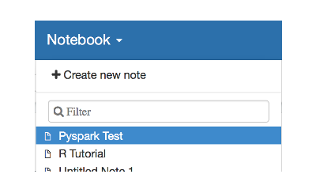
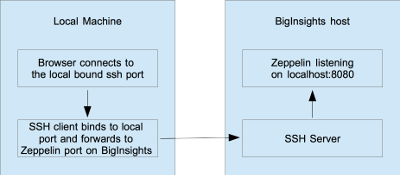

## Overview

This example installs, configures and runs [Zeppelin](https://zeppelin.apache.org) on a BigInsights cluster without requiring root privileges.  Two reasons for running Zeppelin may be:

- to provide data scientists with notebook functionality
- to provide example code in the form of notebooks for services such as hbase


### Security notice

The Installation of Zeppelin will result in Zeppelin server listening for connections on all interfaces on port 8080 (the port can be changed as described [here](#install-zeppelin)) on the cluster mastermanager.  BigInsights for Apache Hadoop on IBM Bluemix is hidden by a firewall and Zeppelin can only be accessed on client machines using a SSH tunnel ([more info](#decomposition-instructions)). The SSH tunnel is setup for you when you execute the [Run](#run-zeppelin) target.  The SSH tunnel ensures only users can only access Zeppelin if they have the credentials to log in via SSH.

 **WARNING:** 

- Any user with access to Zeppelin will be able to access the account that Zeppelin was installed under and execute jobs under the permission of the Zeppelin user account 
- Ensure that the port Zeppelin listens on (8080 by default) is firewalled so that Zeppelin can only be accessed via ssh. Zeppelin is not configured to authenticate users so if the port Zeppelin listens on is not firewalled, anyone will be able to access your cluster.
- As with all of the other examples, this example is community supported.  We will endeavour to make sure the Zeppelin example works with future versions of BigInsights, however this cannot be guaranteed.


## User experience

Users will gain the most from these examples if they are:

- Comfortable using Windows, OS X or *nix command prompts

## Example Requirements

- You meet the [pre-requisites](../../README.md#pre-requisites) in the top level [README](../../README.md)
- You have followed the [setup instructions](../../README.md#setup-instructions) in the top level [README](../../README.md)
- You need to ensure you have the appropriate services running on your cluster for the interpreters you wish to use (e.g. Spark)

## Run the example

### Install Zeppelin

First copy the file `zeppelin_env.sh_template` to `zeppelin_env.sh`.  Ensure that the value for `ZEPPELIN_PORT` is set a port that is available on the cluster.  

Then copy the file `shiro.ini_template` to `shiro.ini`.

Next open a command prompt window:

   - change into the directory containing this example and run gradle to execute the example
      - `./gradlew Install` (OS X / *nix)
      - `gradlew.bat Install` (Windows)
   - some output from running the command on my machine is shown below 

```bash
biginsight-bluemix-docs $ cd examples/Zeppelin
biginsight-bluemix-docs/examples/Zeppelin $ ./gradlew Install
:CreateTruststore
>> Remove truststore
>> Create truststore
:Install
...
BUILD SUCCESSFUL
```

### Granting users access to Zeppelin

After installing Zeppelin, you can grant users to access Zeppelin.  Note that all users access Zeppelin through a ssh tunnel which means that all users require ssh access to the BigInsights cluster.

If the file `shiro.ini` does not exist in the example folder, copy the file `shiro.ini_template` to `shiro.ini`.  

Edit the section `[users]` adding the username and password for each user, e.g.

```bash
[users]
chris = mypassword 
pierre = hispassword
```

Users will need to enter this password to login to the Zeppelin user interface.

Next, run `./gradlew UpdateEnv` to apply the changes:

```bash
$ ./gradlew UpdateEnv
:UpdateEnv
Strict host key checking is off. It may be vulnerable to man-in-the-middle attacks.

>> zeppelin_env.sh has been copied to the cluster.
>> shiro.ini has been copied to the cluster.
>> Run `./gradlew restart` to apply your changes.

BUILD SUCCESSFUL
```

Finally, restart Zeppelin daemon with `./gradlew -q restart` for the changes to take effect:

```bash
$ ./gradlew -q restart
bicluster#1|Zeppelin stop                                  [  OK  ]
bicluster#1|Zeppelin start                                 [  OK  ]
```

### Uninstall Zeppelin

To uninstall Zeppelin, in a command prompt window:

   - change into the directory containing this example and run gradle to execute the example
      - `./gradlew Uninstall` (OS X / *nix)
      - `gradlew.bat Uninstall` (Windows)
   - some output from running the command on my machine is shown below 

```bash
biginsight-bluemix-docs $ cd examples/Zeppelin
biginsight-bluemix-docs/examples/Zeppelin $ ./gradlew Uninstall
:Uninstall
...
BUILD SUCCESSFUL
```

### Run Zeppelin

First install Zeppelin.  Then to run Zeppelin, in a command prompt window:

   - change into the directory containing this example and run gradle to execute the example
      - `./gradlew Run` (OS X / *nix)
      - `gradlew.bat Run` (Windows)
   - some output from running the command on my machine is shown below 

```bash
biginsight-bluemix-docs $ cd examples/Zeppelin
biginsight-bluemix-docs/examples/Zeppelin $ ./gradlew Run
:Run
Strict host key checking is off. It may be vulnerable to man-in-the-middle attacks.
bicluster#0|Zeppelin is running                            [  OK  ]
bicluster#0|
> Building 0% > :Run

- Zeppelin is running.
- Users can connect by creating a ssh tunnel, e.g.

$ ssh -L12345:localhost:8080 ssh_username@bi-hadoop-prod-4146.bi.services.us-south.bluemix.net

   Where '12345' is a port on the local machine
         'ssh_username' is the ssh user account name for the user

- The above command will forward network traffic from their local machine on port 12345
  to the Zeppelin port (8080) on the BigInsights cluster.
- They will then be able to access Zeppelin by opening a browser on their local machine
  and navigating to the URL: http://localhost:12345 (yes localhost!).
- If port 12345 is not available locally users can use a different port.
```

Users would connect to Zeppelin by setting up ssh port forwarding as described in the output from the `./gradlew Run` command.

### Connect to Zeppelin

After installing and running Zeppelin, you can connect to Zeppelin as a test by performing `./gradlew Connect`:

```bash
$ ./gradlew Connect
:Connect
Strict host key checking is off. It may be vulnerable to man-in-the-middle attacks.
bicluster#1|Zeppelin is running                            [  OK  ]
bicluster#1|
> Building 0% > :Connect

SSH forwarding localhost:12345 -> BigInsights zeppelin localhost:8080

You can now access zeppelin from your local machine using the URL: http://localhost:12345


Press ENTER or CTRL+C to quit.

NOTE: - If you quit you will lose your connection to Zeppelin.
      - After quitting you can execute 'Run' again to connect to Zeppelin.
      - Gradle will attempt to bind to port 12345 on your local machine.
        If port 12345 is not available, gradle will automatically allocate a
        a local port.
      - You can set the local port with the gradle '-P' argument, E.g.
         './gradlew Run -PZEP_PORT=23456'
        make sure port you specify is valid and not occupied on your system.
```

Follow the instructions output by the Connect command.  

Users would connect to Zeppelin by setting up ssh port forwarding as described in the output from the `./gradlew Run` command.

### Zeppelin daemon: stop, start, status, restart

You can check the status of the Zeppelin daemon by running `./gradlew -q status`

```bash
$ ./gradlew -q status
bicluster#1|Zeppelin is running                            [  OK  ]
bicluster#1|
```

You can stop the Zeppelin daemon with `./gradlew -q stop`

```bash
$ ./gradlew -q stop
bicluster#1|Zeppelin stop                                  [  OK  ]
```

and start the Zeppelin daemon with `./gradlew -q start`

```bash
$ ./gradlew -q start
bicluster#1|Zeppelin start                                 [  OK  ]
bicluster#1|
```
and restart Zeppelin daemon with `./gradlew -q restart`

```bash
$ ./gradlew -q restart
bicluster#1|Zeppelin stop                                  [  OK  ]
bicluster#1|Zeppelin start                                 [  OK  ]
```

### Test Zeppelin with Pyspark

First run Zeppelin, Then click on the Notebook dropdown menu from the main toolbar and click on the Pyspark Test notebook:



- Click on the 'Pyspark Test' notebook to open it
- Click on the run button in the notebook windows to execute the notebook code 
- Verify the row count output from spark equals the expected row count

You should also be able to see the above spark job running on the spark cluster.  While the notebook is running, you could ssh into the cluster and run the command `yarn application -list`.  

**NOTE**: The spark yarn application should remain in RUNNING state until it is explicilty closed or Zeppelin is restarted. 

### Test Zeppelin with SparkR

*This is a Technology Preview.  Note that SparkR is only available on BigInsights 4.2 Clusters.*

Similar to the instructions for 'Test Zeppelin with Pyspark', there is a notebook 'SparkR Test'.

## Decomposition Instructions

The examples uses a gradle build file [build.gradle](./build.gradle) when you run ./gradlew or gradle.bat. The build.gradle for this 'Run' target does the following:

- verifies that zeppelin has been installed on the cluster
- verifies if zeppelin is running on the cluster, if not zeppelin is not running it is started 
- sets up [port forwarding](https://en.wikipedia.org/wiki/Port_forwarding) on the local machine, see below



Port forwarding works as follows:

- the gradle ssh client binds to a random port on the local machine
- any traffic to this port on the local machine gets forwarded over ssh to the remote zeppelin port
- gradle prints the URL with the random local port on the local machine

Therefore, when you connect to this local URL you are really connecting to the zeppelin service on the cluster.  

## Limitations

- the following interpreters are configured:
  - spark (pySpark and sparkR)
  - livy (pySpark and sparkR)
  - sh
  - hive
  - bigsql (if the cluster has bigsql installed)
